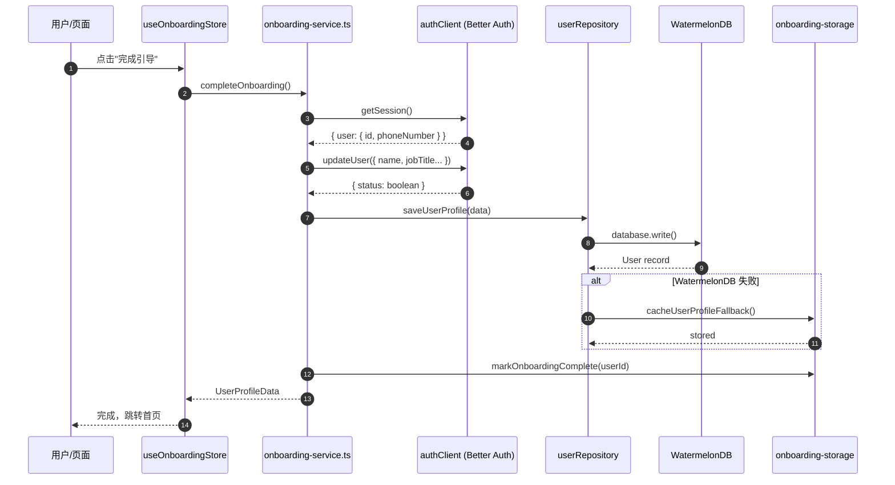
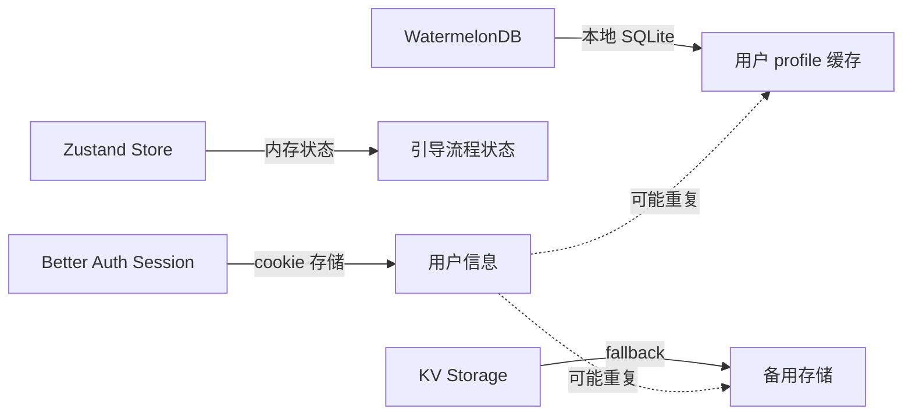
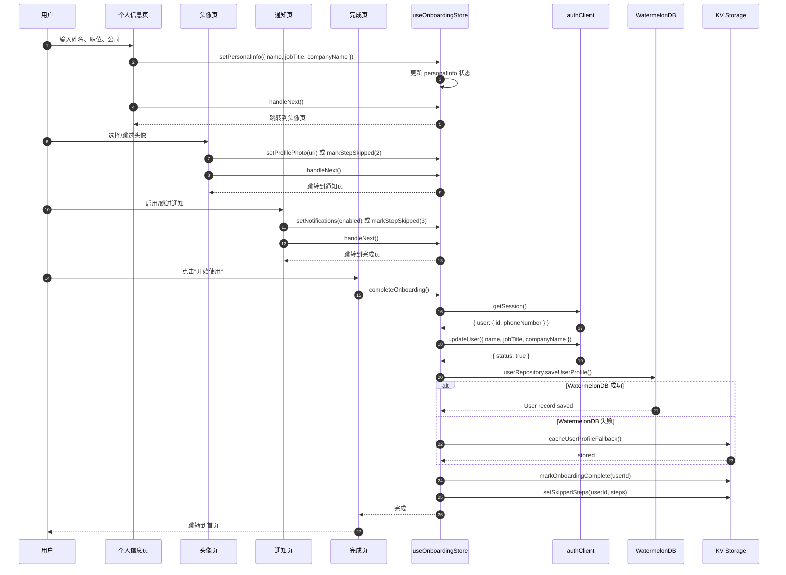
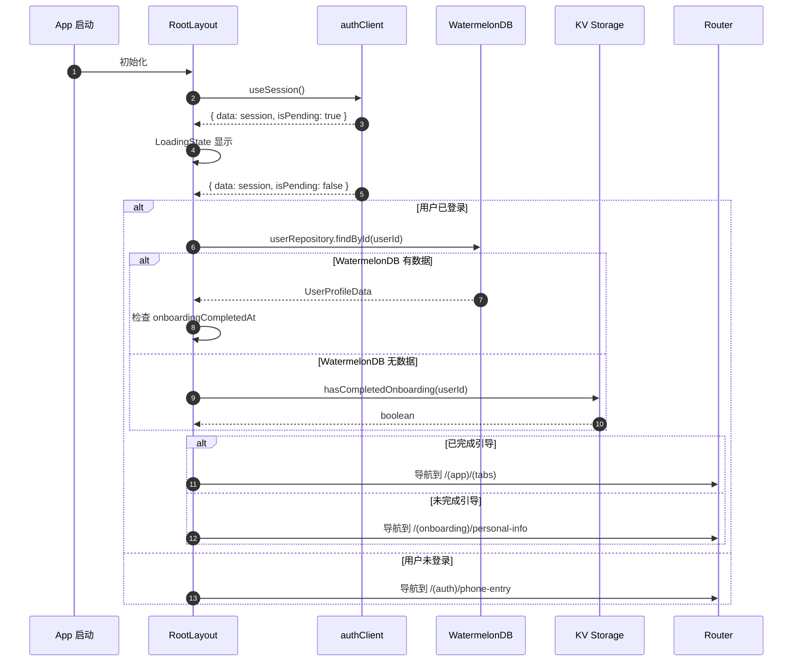
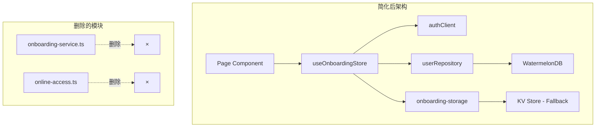

# Onboarding 迁移架构核对文档

> 创建日期: 2026-04-14  
> 目的: 核对迁移设计，识别风险，提出优化建议

---

## 一、整体架构概览

### 1.1 技术栈对比

| 层级 | 旧项目 (pulsebuild-projects) | 新项目 (pulsebuild) | 变化原因 |
|------|------------------------------|---------------------|----------|
| 认证 | Zustand auth-store + token-store | Better Auth (cookie-based) | 统一认证，支持多端 |
| 数据库 | expo-sqlite | WatermelonDB | 离线优先，类型安全 |
| API | 自定义 auth-api | trpc client | 类型安全，统一 API |
| 状态管理 | Zustand | Zustand (保留) | 轻量级，适合局部状态 |

### 1.2 数据流时序图

#### 当前迁移架构时序图



---

## 二、数据库层架构详细分析

### 2.1 模块职责表

| 模块 | 文件路径 | 职责 | 设计原因 | 潜在风险 |
|------|----------|------|----------|----------|
| **Schema** | `lib/database/schema.ts` | 定义 WatermelonDB 表结构 | WatermelonDB 需要显式 schema 初始化 SQLite | Schema version 迁移需处理数据保留 |
| **User Model** | `lib/database/models/User.ts` | 数据模型 + decorators | 提供类型安全的 CRUD + 计算属性 | 装饰器需正确 Babel/TS 配置 |
| **Project Model** | `lib/database/models/Project.ts` | 项目数据模型 | 为未来项目同步预留 | 当前未使用，可能过早设计 |
| **Task Model** | `lib/database/models/Task.ts` | 任务数据模型 | 为未来任务同步预留 | 当前未使用，可能过早设计 |
| **User Repository** | `lib/database/user-repository.ts` | 封装 User CRUD 操作 | 隔离 WatermelonDB API | 可能过度抽象，增加调用链 |
| **Database** | `lib/database/database.ts` | 数据库初始化 | 统一初始化入口 | 无明显风险 |

### 2.2 字段对齐核对

#### 后端 `user` 表 (Drizzle ORM - auth.schema.ts)

```
字段列表:
- id: text (PK)              # Better Auth UUID
- name: text (notNull)       # 用户名
- email: text (unique)       # 邮箱
- emailVerified: boolean     # 邮箱验证状态
- image: text                # 头像 URL
- phoneNumber: varchar(255)  # 手机号
- phoneNumberVerified: boolean
- countryCode: varchar(8)    # 国家区号
- timezone: varchar(64)      # 时区
- jobTitle: varchar(120)     # 职位
- companyName: varchar(120)  # 公司名称
- status: varchar(20)        # 状态 (active/inactive)
- deletedAt: timestamp       # 软删除时间
- lastLoginAt: timestamp     # 最后登录
- createdAt: timestamp
- updatedAt: timestamp
```

#### 移动端 `users` 表 (WatermelonDB)

```
字段列表:
- id: string (PK)            # 映射后端 UUID
- name: string               ✓ 对齐
- email: string              ✓ 对齐
- emailVerified: boolean     ✓ 对齐
- image: string              ✓ 对齐 (原 avatarUrl)
- phoneNumber: string        ✓ 对齐
- phoneNumberVerified: boolean ✓ 对齐
- countryCode: string        ✓ 对齐
- timezone: string           ✓ 对齐
- jobTitle: string           ✓ 对齐
- companyName: string        ✓ 对齐
- status: string             ✓ 对齐
- deletedAt: date            ✓ 对齐
- lastLoginAt: date          ✓ 对齐
- onboardingCompletedAt: date ⚠️ 本地特有字段
- createdAt: date            ✓ 对齐
- updatedAt: date            ✓ 对齐
```

#### 对齐结论

| 状态 | 说明 |
|------|------|
| ✅ 已对齐 | 16 个字段完全对齐后端 |
| ⚠️ 本地特有 | `onboardingCompletedAt` - 后端无此字段，仅用于本地标记 |

---

## 三、服务层架构详细分析

### 3.1 Services 模块职责

| 模块 | 文件路径 | 当前职责 | 是否必须保留 | 替代方案 |
|------|----------|----------|--------------|----------|
| **onboarding-service.ts** | `lib/services/onboarding-service.ts` | 协调 Auth + DB + KV 存储 | ⚠️ **可删除** | 合并到 Store 的 action |
| **onboarding-storage.ts** | `lib/services/onboarding-storage.ts` | KV 存储 (expo-sqlite/kv-store) | ✅ **保留** | 仅作为 WatermelonDB 失败时的 fallback |
| **online-access.ts** | `lib/services/online-access.ts` | 网络连接检测 | ❌ **可删除** | 合并到 `useOnlineAccess` hook 内部 |

### 3.2 onboarding-service.ts 分析

#### 当前职责

```typescript
class OnboardingService {
  // 1. 验证联系方式
  validateContactDetails(input)
  
  // 2. 保存用户到本地数据库
  saveUserProfile(data)
  
  // 3. 完成引导流程 (核心方法)
  completeOnboarding(input)
  
  // 4. 上传头像
  uploadProfilePhoto(uri)
  
  // 5. 获取当前 session
  getCurrentSession()
  
  // 6. 检查是否已完成引导
  hasCompletedOnboarding(userId)
}
```

#### 调用链分析

```
Page Component
    │
    ▼
useOnboardingStore.completeOnboarding()
    │
    ▼
onboardingService.completeOnboarding()  ← 这一层是否必要？
    │
    ├─► authClient.getSession()
    ├─► authClient.updateUser()
    ├─► userRepository.saveUserProfile()
    └─► onboarding-storage.markOnboardingComplete()
```

#### 删除建议

**原因**: Service 层只是简单的函数组合，没有复杂逻辑，可以直接在 Store action 中完成

**简化后**:

```typescript
// stores/onboarding-store.ts
completeOnboarding: async () => {
  const session = await authClient.getSession();
  if (!session.data?.user?.id) throw new Error('请先登录');
  
  // 直接调用，不需要 service 中间层
  await authClient.updateUser({ name, jobTitle, companyName });
  await userRepository.saveUserProfile({ ... });
  await markOnboardingComplete(userId);
}
```

### 3.3 onboarding-storage.ts 分析

#### 当前职责

```typescript
// KV 存储函数列表
hasCompletedOnboarding(userId)   // 检查引导完成状态
markOnboardingComplete(userId)   // 标记完成
getSkippedSteps(userId)          // 获取跳过的步骤
setSkippedSteps(userId, steps)   // 设置跳过步骤
cacheUserProfileFallback(userId, payload)  // 缓存用户 profile (fallback)
getCachedUserProfileFallback(userId)       // 获取缓存
queuePendingPhotoUpload(userId, uri)       // 队列待上传照片
getPendingPhotoUploads(userId)             // 获取待上传列表
clearPendingPhotoUploads(userId)           // 清除队列
```

#### 定位建议

```
数据源优先级:
1. Better Auth session (cookie) ← 主数据源
2. WatermelonDB (SQLite) ← 本地缓存，支持离线
3. onboarding-storage (KV) ← 仅作为 WatermelonDB 失败时的 fallback
```

### 3.4 online-access.ts 分析

#### 当前职责

```typescript
// 网络检测
isOnline()           // 检查是否在线
ensureOnlineAccess() // 确保在线，否则抛异常

// 类型定义
OnlineAccessFeature  // 功能类型枚举
OnlineRequiredError  // 自定义错误类
```

#### 删除建议

**原因**: 这些都是简单函数，可以直接放在 hook 内部

**简化后**:

```typescript
// hooks/use-online-access.ts
export function useOnlineAccess(feature: string) {
  const { isConnected } = useNetworkStatus();
  
  const requireOnline = useCallback((onOffline?: (msg: string) => void) => {
    if (isConnected) return true;
    onOffline?.(`需要网络连接才能使用 ${feature}`);
    return false;
  }, [isConnected, feature]);
  
  return { isConnected, requireOnline, isOffline: !isConnected };
}
```

---

## 四、状态管理层分析

### 4.1 Zustand Store 分析

| Store | 文件路径 | 职责 | 状态字段 |
|------|----------|------|----------|
| **onboarding-store.ts** | `stores/onboarding-store.ts` | 引导流程状态管理 | 见下表 |

#### Store 状态字段

```typescript
interface OnboardingState {
  flowVariant: 'authenticated' | 'legacy';  // 流程类型
  currentStep: number;                       // 当前步骤
  personalInfo: PersonalInfoData;            // 用户输入信息
  profilePhotoUri: string | null;            // 头照片 URI
  notificationsEnabled: boolean;             // 通知开关
  skippedSteps: number[];                    // 跳过的步骤
  isCompleting: boolean;                     // 完成中状态
  isLoading: boolean;                        // 加载状态
  error: string | null;                      // 错误信息
}
```

#### Store Actions

```typescript
setFlowVariant(variant)        // 设置流程类型
setCurrentStep(step)           // 设置当前步骤
setPersonalInfo(data)          // 设置个人信息
setProfilePhoto(uri)           // 设置头像
setNotifications(enabled)      // 设置通知
markStepSkipped(step)          // 标记跳过
resetOnboarding()              // 重置状态
clearError()                   // 清除错误
completeOnboarding()           // 完成引导 ← 核心方法
```

### 4.2 Store 与 Better Auth Session 的关系

#### 问题：数据重复



#### 建议：明确数据源职责

```
┌─────────────────────────────────────────────────────┐
│                   数据源职责划分                      │
├─────────────────────────────────────────────────────┤
│                                                     │
│  Better Auth Session                                │
│  ├─ 主数据源                                        │
│  ├─ 存储: cookie (secure)                           │
│  ├─ 内容: user.id, user.name, user.phoneNumber      │
│  └─ 用途: 认证状态、用户基本信息                     │
│                                                     │
│  WatermelonDB                                       │
│  ├─ 本地缓存                                        │
│  ├─ 存储: SQLite                                    │
│  ├─ 内容: 完整用户 profile                          │
│  └─ 用途: 离线访问、数据同步                        │
│                                                     │
│  KV Storage (onboarding-storage)                    │
│  ├─ Fallback                                       │
│  ├─ 存储: expo-sqlite/kv-store                      │
│  ├─ 内容: onboarding 标记、跳过步骤                 │
│  └─ 用途: WatermelonDB 失败时的最后防线             │
│                                                     │
│  Zustand Store                                      │
│  ├─ UI 状态                                        │
│  ├─ 存储: 内存                                      │
│  ├─ 内容: 引导流程临时状态                          │
│  └─ 用途: 页面交互、表单数据                        │
│                                                     │
└─────────────────────────────────────────────────────┘
```

---

## 五、完整流程时序图

### 5.1 用户完成引导完整流程



### 5.2 应用启动恢复流程



---

## 六、架构风险清单

### 6.1 高风险

| 风险 | 描述 | 影响 | 解决方案 |
|------|------|------|----------|
| **数据不一致** | Better Auth、WatermelonDB、KV 三处存储可能冲突 | 用户状态混乱 | 明确数据源优先级，只在必要时写入 |
| **离线同步** | WatermelonDB 数据未与后端同步机制 | 数据丢失 | 需要实现 trpc sync procedure |

### 6.2 中风险

| 风险 | 描述 | 影响 | 解决方案 |
|------|------|------|----------|
| **过度抽象** | Service 层只是简单函数组合 | 调用链过长 | 合并到 Store action |
| **预留 Model** | Project/Task Model 当前未使用 | 代码膨胀 | 暂时删除或标记为 TODO |
| **Schema 迁移** | version: 2 需处理旧数据 | 数据丢失 | 实现迁移策略 |

### 6.3 低风险

| 雾险 | 描述 | 影响 | 解决方案 |
|------|------|------|----------|
| **装饰器配置** | Babel/TS 配置复杂 | 开发时报错 | 已配置，需文档记录 |
| **字段命名差异** | phoneNumber vs phone_number | 类型错误 | 已对齐，使用 phoneNumber |

---

## 七、简化建议方案

### 方案 A: 最小化架构（推荐）



**删除清单**:
- `lib/services/onboarding-service.ts` → 合并到 Store
- `lib/services/online-access.ts` → 合并到 Hook
- `lib/database/models/Project.ts` → 暂时删除（未使用）
- `lib/database/models/Task.ts` → 暂时删除（未使用）

### 方案 B: 保持当前架构

保持所有模块，但明确职责边界。

---

## 八、决策点

请核对以下决策：

| # | 决策项 | 选项 | 你的选择 |
|---|--------|------|----------|
| 1 | Better Auth session 是否作为主数据源？ | A: 是 / B: 否 | __ |
| 2 | 是否删除 `onboarding-service.ts`？ | A: 删除合并到 Store / B: 保留 | __ |
| 3 | WatermelonDB 定位？ | A: 离线缓存 / B: 独立数据存储 | __ |
| 4 | 是否删除 `online-access.ts`？ | A: 删除合并到 Hook / B: 保留 | __ |
| 5 | 是否删除 Project/Task Model？ | A: 删除 / B: 保留为预留 | __ |
| 6 | 是否需要离线同步机制？ | A: 需要实现 trpc sync / B: 暂不需要 | __ |

---

## 九、文件清单

### 当前迁移文件列表

```
apps/mobile/src/
├── app/(onboarding)/
│   ├── _layout.tsx          # 路由布局
│   ├── personal-info.tsx    # Step 1: 个人信息
│   ├── profile-photo.tsx    # Step 2: 头像
│   ├── notifications.tsx    # Step 3: 通知
│   └── welcome.tsx          # Step 4: 完成
│
├── components/onboarding/
│   ├── onboarding-layout.tsx   # 布局组件
│   ├── progress-indicator.tsx  # 进度条
│   ├── feature-highlight.tsx   # 功能卡片
│   ├── profile-photo-uploader.tsx # 头像上传
│   └── index.ts
│
├── lib/database/
│   ├── schema.ts            # WatermelonDB schema
│   ├── database.ts          # DB 初始化
│   ├── user-repository.ts   # User CRUD
│   ├── models/
│   │   ├── User.ts          # User Model
│   │   ├── Project.ts       # Project Model (未使用)
│   │   ├── Task.ts          # Task Model (未使用)
│   │   └── index.ts
│   └── index.ts
│
├── lib/services/
│   ├── onboarding-service.ts    # ⚠️ 可删除
│   ├── onboarding-storage.ts    # KV fallback
│   └── online-access.ts         # ⚠️ 可删除
│
├── lib/types/
│   ├── onboarding.ts        # 类型定义
│   ├── user.ts              # 类型定义
│
├── lib/validation/
│   └── onboarding-validation.ts # 表单验证
│
├── hooks/
│   ├── use-onboarding-progress.ts
│   ├── use-online-access.ts
│   └── index.ts
│
└── stores/
    └── onboarding-store.ts  # Zustand store
```

---

## 十、下一步行动

待用户核对决策后：

1. 根据决策调整架构
2. 删除/合并指定模块
3. 更新文档记录最终架构
4. 实现缺失功能（如 trpc sync）