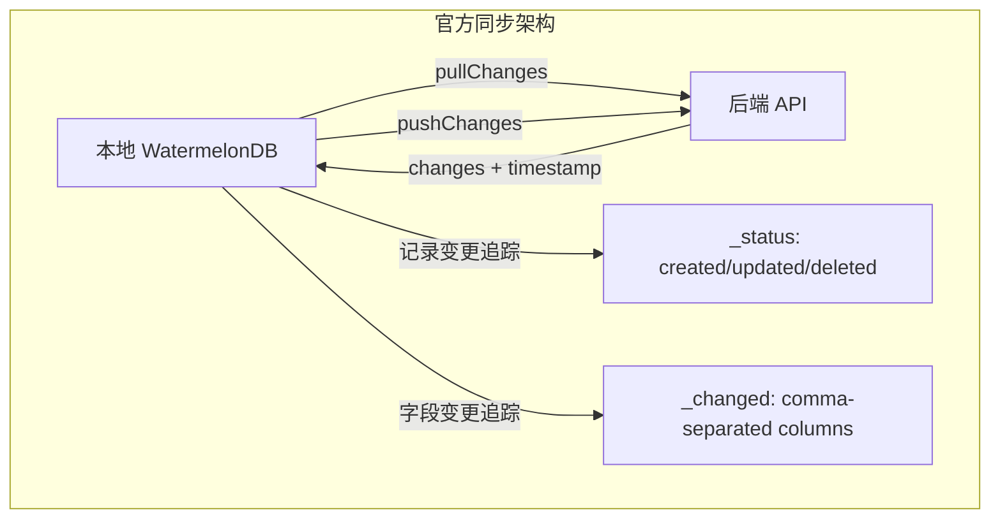
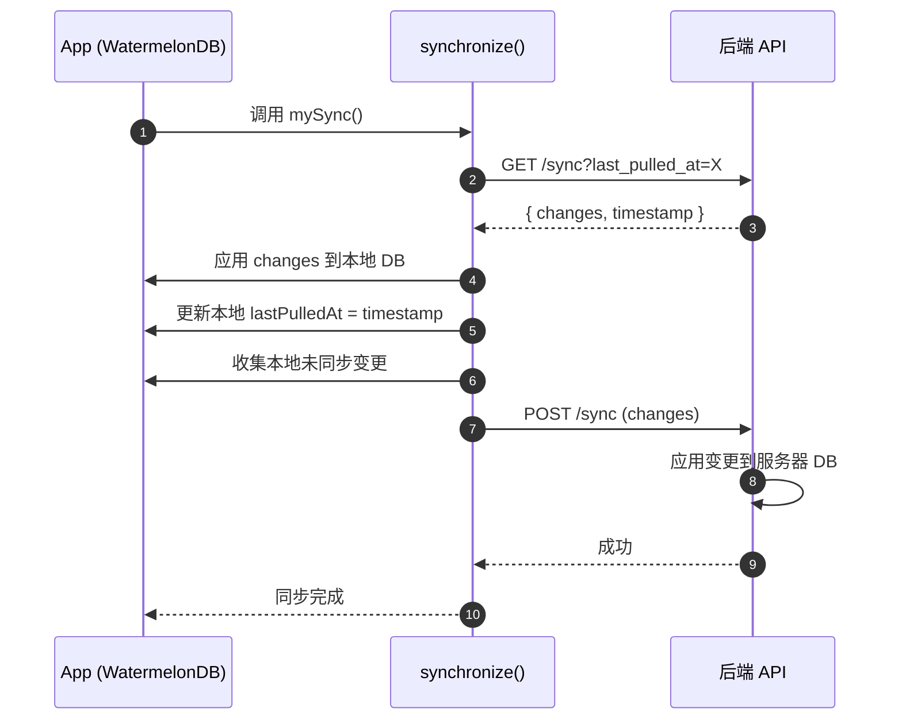
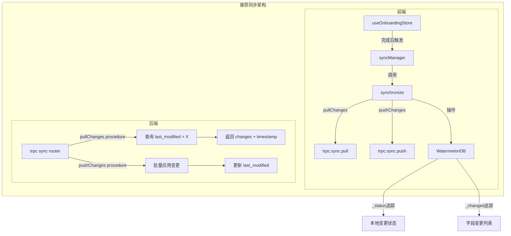

# WatermelonDB 同步方案对比分析

> 创建日期: 2026-04-14  
> 对比内容: 当前迁移方案 vs WatermelonDB 官方同步文档

---

## 一、官方同步架构核心要点

### 1.1 WatermelonDB 同步原理



**核心机制**：
- `_status` 字段：记录本地状态
- `_changed` 字段：记录哪些列被修改
- 本地 ID = 远程 ID（无需映射）

### 1.2 同步流程时序图（官方）



---

## 二、当前方案 vs 官方方案对比

### 2.1 架构对比表

| 维度 | 当前迁移方案 | WatermelonDB 官方方案 | 差距分析 |
|------|--------------|----------------------|----------|
| **同步方式** | 手动调用 `userRepository.saveUserProfile()` | 使用 `synchronize()` 函数 | ❌ 未使用官方同步 API |
| **变更追踪** | 无 `_status`、`_changed` 字段 | Schema 自动添加 `_status`、`_changed` | ❌ Schema 缺少同步字段 |
| **ID 设计** | 本地 ID 独立生成 | 本地 ID = 远程 ID（直接使用 Better Auth UUID） | ⚠️ 可以对齐，但需要调整 |
| **Pull API** | 无 | 需要 `GET /sync?last_pulled_at=X` | ❌ 后端无 sync endpoint |
| **Push API** | 通过 Better Auth updateUser | 需要 `POST /sync` | ❌ 未实现批量变更推送 |
| **后端变更追踪** | 无 `last_modified` 字段 | 需要所有表添加 `last_modified` | ❌ 后端无此字段 |
| **删除追踪** | softDelete (deleted_at) | 需要 deleted_xxx 表或软删除标记 | ⚠️ 可以复用 deleted_at |

### 2.2 Schema 字段对比

#### 当前 Schema

```typescript
tableSchema({
  name: 'users',
  columns: [
    { name: 'name', type: 'string' },
    { name: 'email', type: 'string' },
    // ... 其他业务字段
    { name: 'deleted_at', type: 'number' },
    { name: 'created_at', type: 'number' },
    { name: 'updated_at', type: 'number' },
  ],
}),
```

#### 官方要求 Schema

```typescript
// WatermelonDB 会自动添加以下字段（如果使用同步）
tableSchema({
  name: 'users',
  columns: [
    { name: '_status', type: 'string' },     // ← 同步状态：created/updated/deleted/synced
    { name: '_changed', type: 'string' },    // ← 变更列：逗号分隔的列名
    // ... 业务字段
    { name: 'last_modified', type: 'number' }, // ← 用于本地排序（可选）
  ],
}),
```

**差距**：当前 Schema 未启用同步字段

---

## 三、当前方案问题清单

### 3.1 高优先级问题

| # | 问题 | 影响 | 官方要求 |
|---|------|------|----------|
| 1 | **未使用 `synchronize()` 函数** | 无法自动同步，需手动处理 | 必须使用官方同步 API |
| 2 | **Schema 缺少 `_status`、`_changed`** | 无法追踪本地变更 | 同步必须字段 |
| 3 | **后端无 sync endpoint** | 无法 pull/push 变更 | 需要 `GET/POST /sync` |

### 3.2 中优先级问题

| # | 问题 | 影响 | 官方建议 |
|---|------|------|----------|
| 4 | **后端无 `last_modified` 字段** | 无法追踪服务器变更时间 | 添加到所有同步表 |
| 5 | **无 `hasUnsyncedChanges()` 检查** | 无法判断是否需要同步 | 应定期检查 |
| 6 | **无迁移处理** | Schema 版本变更未处理 | 需配置 `migrationsEnabledAtVersion` |

### 3.3 低优先级问题

| # | 问题 | 影响 | 说明 |
|---|------|------|------|
| 7 | **push 失败无冲突处理** | 可能数据不一致 | 官方也有限制 |
| 8 | **Project/Task Model 未使用** | 代码膨胀 | 可暂缓同步实现 |

---

## 四、正确同步架构方案

### 4.1 推荐架构（符合官方）



### 4.2 修正后的 Schema

```typescript
// lib/database/schema.ts
import { appSchema, tableSchema } from '@nozbe/watermelondb';

export const schema = appSchema({
  version: 3, // 新版本，启用同步字段
  tables: [
    tableSchema({
      name: 'users',
      columns: [
        // WatermelonDB 同步会自动添加 _status 和 _changed
        // 无需手动定义
        
        // Better Auth core fields
        { name: 'name', type: 'string' },
        { name: 'email', type: 'string', isIndexed: true },
        { name: 'email_verified', type: 'boolean' },
        { name: 'image', type: 'string' },
        { name: 'phone_number', type: 'string', isIndexed: true },
        { name: 'phone_number_verified', type: 'boolean' },
        
        // Extended fields
        { name: 'country_code', type: 'string' },
        { name: 'timezone', type: 'string' },
        { name: 'job_title', type: 'string' },
        { name: 'company_name', type: 'string' },
        { name: 'status', type: 'string' },
        
        // Sync-related fields
        { name: 'last_modified', type: 'number', isIndexed: true }, // ← 新增
        { name: 'deleted_at', type: 'number' },
        { name: 'last_login_at', type: 'number' },
        { name: 'onboarding_completed_at', type: 'number' },
        { name: 'created_at', type: 'number' },
        { name: 'updated_at', type: 'number' },
      ],
    }),
  ],
});
```

### 4.3 同步函数实现（官方推荐）

```typescript
// lib/sync/sync-manager.ts
import { synchronize, hasUnsyncedChanges } from '@nozbe/watermelondb/sync';
import { database } from '@/lib/database';
import { trpc } from '@/lib/trpc';

export async function syncDatabase() {
  await synchronize({
    database,
    pullChanges: async ({ lastPulledAt, schemaVersion, migration }) => {
      const result = await trpc.sync.pull.query({
        lastPulledAt,
        schemaVersion,
        migration,
      });
      
      return {
        changes: result.changes,
        timestamp: result.timestamp,
      };
    },
    pushChanges: async ({ changes, lastPulledAt }) => {
      await trpc.sync.push.mutate({
        changes,
        lastPulledAt,
      });
    },
    migrationsEnabledAtVersion: 3,
  });
}

export async function checkNeedsSync(): Promise<boolean> {
  return await hasUnsyncedChanges({ database });
}
```

### 4.4 后端 trpc Sync Router 设计

```typescript
// apps/backend/src/modules/sync/sync.router.ts
import { Router, Query, Mutation } from 'nestjs-trpc';
import { z } from 'zod';

@Router({ alias: 'sync' })
export class SyncRouter {
  
  @Query({
    input: z.object({
      lastPulledAt: z.number().nullable(),
      schemaVersion: z.number(),
      migration: z.any().nullable(),
    }),
    output: z.object({
      changes: z.any(), // Changes object
      timestamp: z.number(),
    }),
  })
  async pull(input: { lastPulledAt: number | null; schemaVersion: number; migration: any | null }) {
    // 1. 如果 lastPulledAt 为 null，返回所有可访问记录
    // 2. 否则返回 last_modified > lastPulledAt 的变更
    // 3. 需要包含 created、updated、deleted
    
    const changes = await this.syncService.getChangesSince(input.lastPulledAt);
    const timestamp = Date.now();
    
    return { changes, timestamp };
  }
  
  @Mutation({
    input: z.object({
      changes: z.any(),
      lastPulledAt: z.number(),
    }),
    output: z.object({ success: z.boolean() }),
  })
  async push(input: { changes: any; lastPulledAt: number }) {
    // 1. 应用 created：创建新记录（ID 已存在则更新）
    // 2. 应用 updated：更新记录（不存在则创建）
    // 3. 应用 deleted：删除记录（不存在则忽略）
    // 4. 必须事务化
    // 5. 检查 last_modified 是否在 lastPulledAt 之后被修改
    
    await this.syncService.applyChanges(input.changes);
    return { success: true };
  }
}
```

### 4.5 后端 last_modified 字段设计

```typescript
// apps/backend/src/database/auth.schema.ts (修改)
export const user = pgTable('user', {
  // ... 其他字段
  
  // 新增：用于同步追踪
  lastModified: timestamp('last_modified', { precision: 3 })
    .defaultNow()
    .$onUpdate(() => new Date())
    .notNull(),
  
  // deleted_at 已存在，可用于追踪删除
});
```

---

## 五、同步 Changes 数据格式

### 5.1 官方格式定义

```typescript
interface Changes {
  [tableName: string]: {
    created: RawRecord[];  // 新创建的记录（完整数据）
    updated: RawRecord[];  // 更新的记录（完整数据）
    deleted: string[];     // 删除的记录（仅 ID）
  };
}

interface RawRecord {
  id: string;
  [columnName: string]: string | number | boolean | null;
}
```

### 5.2 示例数据

```json
{
  "users": {
    "created": [
      { "id": "abc123", "name": "张三", "email": "zhang@example.com", "status": "active" }
    ],
    "updated": [
      { "id": "xyz789", "name": "李四", "job_title": "工程师" }
    ],
    "deleted": ["old_id_1", "old_id_2"]
  },
  "projects": {
    "created": [],
    "updated": [],
    "deleted": []
  }
}
```

---

## 六、迁移建议方案

### 方案 A：渐进式实现（推荐）

| Phase | 内容 | 说明 |
|-------|------|------|
| **Phase 1** | 当前方案维持 | 先完成 onboarding 功能，暂不实现同步 |
| **Phase 2** | 添加同步字段 | Schema 添加 `last_modified`，启用 `_status`/`_changed` |
| **Phase 3** | 实现后端 sync router | 添加 `trpc.sync.pull/push` |
| **Phase 4** | 前端集成 synchronize | 替换手动 save 为 sync |

### 方案 B：立即实现完整同步

一次性实现所有同步功能，但会增加复杂度。

---

## 七、当前方案调整建议

### 7.1 立即需要调整

| # | 调整项 | 代码位置 | 修改内容 |
|---|--------|----------|----------|
| 1 | Schema 版本升级 | `lib/database/schema.ts` | version: 2 → 3，添加 `last_modified` |
| 2 | 移除手动 storage fallback | `lib/services/onboarding-storage.ts` | 减少重复存储 |
| 3 | Model 添加同步装饰器 | `lib/database/models/User.ts` | 添加 `@nozbe/watermelondb/decorators` |

### 7.2 暂缓实现（Phase 2）

| # | 暂缓项 | 原因 |
|---|--------|------|
| 1 | `synchronize()` 函数 | 需要后端 sync endpoint |
| 2 | trpc sync router | 后端需要添加 last_modified |
| 3 | Project/Task 同步 | 当前不需要 |

---

## 八、风险对比

### 当前方案风险

| 风险 | 说明 | 严重度 |
|------|------|--------|
| **数据不一致** | Better Auth + WatermelonDB + KV 三处存储 | 🔴 高 |
| **无自动同步** | 手动 save，可能遗漏 | 🟡 中 |
| **无法追踪变更** | 无 `_status`/`_changed` | 🟡 中 |

### 官方方案风险

| 风险 | 说明 | 严重度 | 官方建议 |
|------|------|--------|----------|
| **Push 失败无冲突列表** | 服务器变更导致 push 失败 | 🟡 中 | 强制重新 pull |
| **重复拉取已推送数据** | 不必要的网络请求 | 🟢 低 | 可优化 |
| **ID 冲突概率** | 10亿记录 6e-8 概率 | 🟢 低 | 可接受 |

---

## 九、决策点（补充）

基于官方文档对比，新增决策项：

| # | 决策项 | 选项 | 建议选择 |
|---|--------|------|----------|
| 7 | 是否使用官方 `synchronize()` 函数？ | A: 是（Phase 2）/ B: 手动实现 | **A** |
| 8 | Schema 是否添加 `last_modified`？ | A: 立即添加 / B: Phase 2 | **A** |
| 9 | 是否删除 KV fallback？ | A: 完全删除 / B: 保留作为最后防线 | **B** |
| 10 | 后端是否添加 sync router？ | A: Phase 2 实现 / B: 暂不 | **A** |

---

## 十、参考资料

- [WatermelonDB Sync Intro](https://watermelondb.dev/docs/Sync/Intro)
- [WatermelonDB Sync Frontend](https://watermelondb.dev/docs/Sync/Frontend)
- [WatermelonDB Sync Backend](https://watermelondb.dev/docs/Sync/Backend)
- [WatermelonDB Sync Limitations](https://watermelondb.dev/docs/Sync/Limitations)
- [WatermelonDB Sync FAQ](https://watermelondb.dev/docs/Sync/FAQ)
- [WatermelonDB Sync Troubleshoot](https://watermelondb.dev/docs/Sync/Troubleshoot)
- [Firemelon (参考实现)](https://github.com/AliAllaf/firemelon)

---

## 十一、实施进度记录

> 更新日期: 2026-04-14

### 已完成阶段

| Phase | 状态 | 完成内容 |
|-------|------|----------|
| **Phase 1** | ✅ 完成 | Schema 升级至 v3，添加 `last_modified`、`email_verified`、`phone_number_verified`、`status` 字段 |
| **Phase 2** | ✅ 完成 | 创建 `migrations.ts`，支持 v2 → v3 迁移（含字段重命名） |
| **Phase 3** | ✅ 完成 | 前端 `sync-manager.ts` 实现 WatermelonDB 官方 `synchronize()` |
| **Phase 4** | ✅ 完成 | 后端 trpc sync router（`sync.pull`/`sync.push` procedures） |
| **Phase 5** | ✅ 完成 | 删除冗余模块：`onboarding-service.ts`、`online-access.ts` |
| **Phase 6** | ✅ 完成 | `onboarding-store.ts` 集成 `syncManager.sync()`，完成 onboarding 后自动同步 |

### 关键文件变更

#### 前端 (apps/mobile)

| 文件 | 变更类型 | 说明 |
|------|----------|------|
| `lib/database/schema.ts` | 更新 | 版本 v2 → v3，添加同步追踪字段 |
| `lib/database/migrations.ts` | 新增 | 迁移定义，处理字段重命名 |
| `lib/database/sync-manager.ts` | 新增 | WatermelonDB 官方同步实现 |
| `lib/database/models/User.ts` | 更新 | 添加 `lastModified` 属性、`updateProfile` 方法 |
| `stores/onboarding-store.ts` | 更新 | 集成 `syncManager.sync()` |
| `lib/services/onboarding-service.ts` | 删除 | 冗余，逻辑移至 store |
| `lib/services/online-access.ts` | 删除 | 合并至 `hooks/use-online-access.ts` |

#### 后端 (apps/backend)

| 文件 | 变更类型 | 说明 |
|------|----------|------|
| `modules/system/sync/sync.schema.ts` | 新增 | Zod schemas for sync protocol |
| `modules/system/sync/sync.service.ts` | 新增 | Pull/Push 实现 |
| `modules/system/sync/sync.router.ts` | 新增 | trpc sync.pull / sync.push endpoints |
| `modules/system/sync/sync.module.ts` | 新增 | NestJS module |
| `database/auth.schema.ts` | 更新 | 添加 `lastModified` 字段 |
| `app.module.ts` | 更新 | 注册 SyncModule |

### 待验证项

| # | 项目 | 状态 |
|---|------|------|
| 1 | TypeScript 类型检查通过 | ✅ 已验证 |
| 2 | 后端 trpc 类型生成 | ⏳ 待执行 |
| 3 | 端到端同步测试 | ⏳ 待测试 |
| 4 | WatermelonDB Migration 测试 | ⏳ 待测试 |