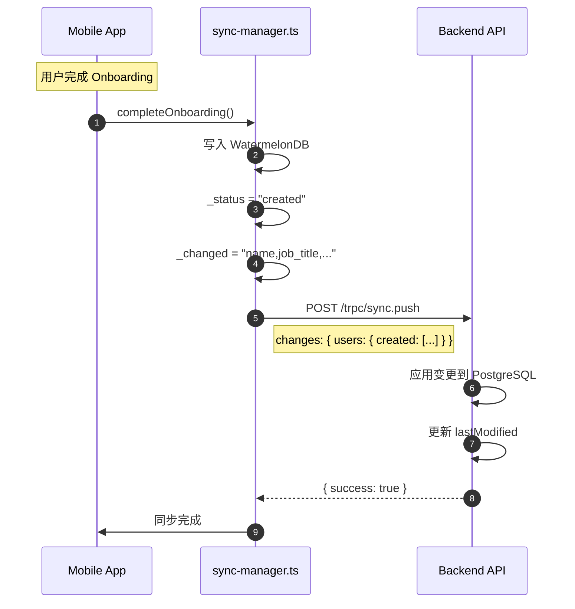

# WatermelonDB 同步集成 - 核对梳理清单

> 创建日期: 2026-04-14
> 目的：系统性核对本次大改动的所有变更

---

## 一、变更文件清单

### 1.1 前端新增文件 (apps/mobile)

| 文件 | 类型 | 作用 | 核对状态 |
|------|------|------|----------|
| `src/lib/database/database.ts` | 核心 | WatermelonDB 数据库实例 | ⬜ |
| `src/lib/database/schema.ts` | 核心 | Schema v3 定义（含同步字段） | ⬜ |
| `src/lib/database/migrations.ts` | 核心 | v2→v3 迁移定义 | ⬜ |
| `src/lib/database/sync-manager.ts` | 核心 | 官方 synchronize() 实现 | ⬜ |
| `src/lib/database/models/index.ts` | 导出 | Models 统一导出 | ⬜ |
| `src/lib/database/models/User.ts` | Model | 用户 Model（含 @writer） | ⬜ |
| `src/lib/database/models/Project.ts` | Model | 项目 Model | ⬜ |
| `src/lib/database/models/Task.ts` | Model | 任务 Model | ⬜ |
| `src/lib/database/user-repository.ts` | Repository | 用户数据访问层 | ⬜ |
| `src/stores/onboarding-store.ts` | Store | Zustand + WatermelonDB 集成 | ⬜ |
| `src/lib/services/onboarding-storage.ts` | KV | KV fallback 存储 | ⬜ |
| `src/lib/types/onboarding.ts` | 类型 | Onboarding 类型定义 | ⬜ |
| `src/lib/types/user.ts` | 类型 | User 类型定义 | ⬜ |
| `src/lib/validation/onboarding-validation.ts` | 验证 | 表单验证逻辑 | ⬜ |
| `src/hooks/use-online-access.ts` | Hook | 网络状态检测 | ⬜ |
| `src/hooks/use-onboarding-progress.ts` | Hook | 进度追踪 | ⬜ |
| `src/app/(onboarding)/_layout.tsx` | 路由 | Onboarding 路由组布局 | ⬜ |
| `src/app/(onboarding)/welcome.tsx` | 页面 | 欢迎页（最终步骤） | ⬜ |
| `src/app/(onboarding)/personal-info.tsx` | 页面 | 个人信息页 | ⬜ |
| `src/app/(onboarding)/profile-photo.tsx` | 页面 | 头像上传页 | ⬜ |
| `src/app/(onboarding)/notifications.tsx` | 页面 | 通知设置页 | ⬜ |
| `src/components/onboarding/*.tsx` | 组件 | Onboarding UI 组件 | ⬜ |
| `src/components/common/online-required-notice.tsx` | 组件 | 离线提示组件 | ⬜ |
| `src/components/common/confirmation-dialog.tsx` | 组件 | 确认对话框 | ⬜ |

### 1.2 前端修改文件 (apps/mobile)

| 文件 | 修改内容 | 核对状态 |
|------|----------|----------|
| `package.json` | 新增 WatermelonDB 依赖 | ⬜ |
| `babel.config.js` | WatermelonDB Babel 插件 | ⬜ |
| `tsconfig.json` | 类型配置 | ⬜ |
| `src/hooks/index.ts` | 导出新增 hooks | ⬜ |
| `src/components/common/index.ts` | 导出新增组件 | ⬜ |

### 1.3 后端新增文件 (apps/backend)

| 文件 | 类型 | 作用 | 核对状态 |
|------|------|------|----------|
| `src/modules/system/sync/sync.module.ts` | Module | NestJS 模块 | ⬜ |
| `src/modules/system/sync/sync.router.ts` | Router | trpc sync.pull/push | ⬜ |
| `src/modules/system/sync/sync.service.ts` | Service | Pull/Push 实现 | ⬜ |
| `src/modules/system/sync/sync.schema.ts` | Schema | Zod 输入输出定义 | ⬜ |

### 1.4 后端修改文件 (apps/backend)

| 文件 | 修改内容 | 核对状态 |
|------|----------|----------|
| `src/database/auth.schema.ts` | 添加 lastModified 字段 | ⬜ |
| `src/app.module.ts` | 注册 SyncModule | ⬜ |

### 1.5 文档文件 (docs/migration)

| 文件 | 内容 | 核对状态 |
|------|------|----------|
| `watermelondb-sync-comparison.md` | 同步方案对比 + 进度记录 | ⬜ |
| `watermelondb-components-analysis.md` | Components 使用分析 | ⬜ |
| `onboarding-migration.md` | Onboarding 迁移规划 | ⬜ |
| `onboarding-architecture-review.md` | 架构评审 | ⬜ |

---

## 二、核心架构核对

### 2.1 数据流架构图

```
┌─────────────────────────────────────────────────────────────────────┐
│                         前端 (Mobile App)                            │
├─────────────────────────────────────────────────────────────────────┤
│                                                                      │
│  ┌──────────────────┐    ┌──────────────────┐    ┌────────────────┐ │
│  │  Onboarding UI   │───►│  Zustand Store   │───►│  WatermelonDB  │ │
│  │  (表单输入)      │    │  (临时状态)      │    │  (本地持久化)  │ │
│  └──────────────────┘    └──────────────────┘    └────────────────┘ │
│                                                          │           │
│                                                          │ sync      │
│                                                          ▼           │
│  ┌────────────────────────────────────────────────────────────────┐ │
│  │                      sync-manager.ts                           │ │
│  │  ┌─────────────────┐           ┌─────────────────┐             │ │
│  │  │  pullChanges()  │◄──────────│  pushChanges()  │             │ │
│  │  │  fetch GET      │           │  fetch POST     │             │ │
│  │  └─────────────────┘           └─────────────────┘             │ │
│  └────────────────────────────────────────────────────────────────┘ │
│                                    │                                 │
└────────────────────────────────────│─────────────────────────────────┘
                                     │
                                     │ HTTP + Cookie Auth
                                     ▼
┌─────────────────────────────────────────────────────────────────────┐
│                         后端 (Backend API)                           │
├─────────────────────────────────────────────────────────────────────┤
│                                                                      │
│  ┌──────────────────┐    ┌──────────────────┐    ┌────────────────┐ │
│  │  trpc sync.pull  │───►│  SyncService     │───►│  Drizzle ORM   │ │
│  │  trpc sync.push  │    │  (变更处理)      │    │  (PostgreSQL)  │ │
│  └──────────────────┘    └──────────────────┘    └────────────────┘ │
│                                                          │           │
│                                                          │           │
│  ┌────────────────────────────────────────────────────────────────┐ │
│  │  auth.schema.ts                                                 │ │
│  │  ┌─────────────────┐                                           │ │
│  │  │  lastModified   │  timestamp  (同步追踪)                    │ │
│  │  │  updatedAt      │  timestamp  (通用更新)                    │ │
│  │  └─────────────────┘                                           │ │
│  └────────────────────────────────────────────────────────────────┘ │
│                                                                      │
└─────────────────────────────────────────────────────────────────────┘
```

### 2.2 同步协议核对



### 2.3 Schema 字段对照表

| 前端 WatermelonDB | 后端 Drizzle | 同步必需 | 核对 |
|-------------------|---------------|----------|------|
| `id` | `id` | ✅ 主键 | ⬜ |
| `name` | `name` | ✅ | ⬜ |
| `email` | `email` | ✅ 索引 | ⬜ |
| `email_verified` | `emailVerified` | ✅ | ⬜ |
| `phone_number` | `phoneNumber` | ✅ 索引 | ⬜ |
| `phone_number_verified` | `phoneNumberVerified` | ✅ | ⬜ |
| `image` | `image` | ✅ | ⬜ |
| `job_title` | `jobTitle` | ✅ | ⬜ |
| `company_name` | `companyName` | ✅ | ⬜ |
| `status` | `status` | ✅ | ⬜ |
| `last_modified` | `lastModified` | ✅ 同步追踪 | ⬜ |
| `deleted_at` | `deletedAt` | ✅ 软删除 | ⬜ |
| `onboarding_completed_at` | `onboardingCompletedAt` | ✅ | ⬜ |
| `created_at` | `createdAt` | ✅ | ⬜ |
| `updated_at` | `updatedAt` | ✅ | ⬜ |

---

## 三、验证步骤清单

### 3.1 TypeScript 编译验证

```bash
# 前端
cd apps/mobile && npx tsc --noEmit

# 后端
cd apps/backend && npx tsc --noEmit
```

| 检查项 | 状态 |
|--------|------|
| 前端无 TS 错误 | ⬜ |
| 后端无 TS 错误 | ⬜ |

### 3.2 依赖安装验证

```bash
# 安装依赖
pnpm install

# 检查 WatermelonDB 依赖
pnpm list @nozbe/watermelondb @nozbe/watermelondb/sync
```

| 检查项 | 状态 |
|--------|------|
| `@nozbe/watermelondb` 已安装 | ⬜ |
| Babel 插件配置正确 | ⬜ |

### 3.3 数据库初始化验证

```bash
# 运行 app，检查数据库初始化
# 预期：Schema v3 自动创建，迁移执行
```

| 检查项 | 状态 |
|--------|------|
| 数据库文件创建 | ⬜ |
| Schema v3 表结构正确 | ⬜ |
| Migration v2→v3 执行成功 | ⬜ |

### 3.4 Onboarding 流程验证

| 步骤 | 测试内容 | 状态 |
|------|----------|------|
| 1 | 登录后跳转到 onboarding | ⬜ |
| 2 | 个人信息表单保存到 Zustand | ⬜ |
| 3 | 头像上传保存 URI | ⬜ |
| 4 | 通知设置保存 | ⬜ |
| 5 | Welcome 页点击完成 | ⬜ |
| 6 | WatermelonDB 写入成功 | ⬜ |
| 7 | sync.push 调用成功 | ⬜ |
| 8 | 跳转到主应用 | ⬜ |

### 3.5 同步功能验证

```bash
# 后端启动
cd apps/backend && pnpm dev

# 前端启动
cd apps/mobile && pnpm start
```

| 检查项 | 状态 |
|--------|------|
| 后端 sync.pull endpoint 可访问 | ⬜ |
| 后端 sync.push endpoint 可访问 | ⬜ |
| Cookie 认证正确传递 | ⬜ |
| Pull 返回正确 changes 格式 | ⬜ |
| Push 应用变更成功 | ⬜ |

---

## 四、代码质量核对

### 4.1 文件行数检查

| 规则 | 最大 300 行 |
|------|-------------|

| 文件 | 行数 | 状态 |
|------|------|------|
| `schema.ts` | ~50 | ✅ |
| `migrations.ts` | ~60 | ✅ |
| `sync-manager.ts` | ~177 | ✅ |
| `User.ts` | ~100 | ✅ |
| `Task.ts` | ~71 | ✅ |
| `Project.ts` | ? | ⬜ 需检查 |
| `user-repository.ts` | ~187 | ✅ |
| `onboarding-store.ts` | ~182 | ✅ |
| `personal-info.tsx` | ~262 | ✅ |
| `welcome.tsx` | ~182 | ✅ |

### 4.2 安全检查

| 检查项 | 状态 |
|--------|------|
| 无硬编码 secrets | ⬜ |
| API URL 使用环境变量 | ⬜ |
| Cookie 安全传输 | ⬜ |
| 输入验证（Zod） | ⬜ |

### 4.3 错误处理检查

| 文件 | try-catch | 错误信息 | 状态 |
|------|-----------|----------|------|
| `sync-manager.ts` | ✅ | 有 | ⬜ |
| `onboarding-store.ts` | ✅ | 有 | ⬜ |
| `user-repository.ts` | ✅ | 有 | ⬜ |

---

## 五、待完成项

### 5.1 高优先级

| # | 任务 | 说明 |
|---|------|------|
| 1 | 后端 trpc 类型生成 | 确保 sync.pull/push 类型可用 |
| 2 | 端到端同步测试 | 完整流程验证 |
| 3 | Migration 测试 | 旧用户数据迁移 |

### 5.2 中优先级

| # | 任务 | 说明 |
|---|------|------|
| 4 | DatabaseProvider 集成 | 为后续页面做准备 |
| 5 | 响应式 hooks 创建 | useUserObservable 等 |
| 6 | 离线模式测试 | 断网场景验证 |

### 5.3 低优先级

| # | 任务 | 说明 |
|---|------|------|
| 7 | Project/Task 同步 | 当前不需要 |
| 8 | 冲突处理策略 | 简单版本暂不处理 |

---

## 六、核对执行顺序建议

```
Phase 1: 编译验证
├── 1.1 前端 tsc --noEmit
├── 1.2 后端 tsc --noEmit
└── 1.3 pnpm install 检查依赖

Phase 2: 代码审查
├── 2.1 检查文件行数
├── 2.2 检查安全项
└── 2.3 检查错误处理

Phase 3: 功能测试
├── 3.1 数据库初始化
├── 3.2 Onboarding 流程
└── 3.3 同步功能

Phase 4: 文档更新
├── 4.1 更新本核对清单
├── 4.2 更新 sync-comparison.md
└── 4.3 记录测试结果
```

---

## 七、快速核对脚本

```bash
# 一键检查编译
cd apps/mobile && npx tsc --noEmit && echo "✅ Mobile TS OK"
cd apps/backend && npx tsc --noEmit && echo "✅ Backend TS OK"

# 检查依赖
pnpm list @nozbe/watermelondb

# 检查文件行数
find apps/mobile/src/lib/database -name "*.ts" -exec wc -l {} \;
```

---

## 八、核对记录区

> 在此区域记录核对结果

### 编译验证记录

| 日期 | 结果 | 备注 |
|------|------|------|
| 2026-04-14 | ✅ Mobile TS OK | 已验证 |
| 2026-04-14 | ? Backend | 待验证 |

### 功能测试记录

| 日期 | 测试项 | 结果 | 备注 |
|------|--------|------|------|
| | | | |

### 问题记录

| # | 发现问题 | 解决方案 | 状态 |
|---|----------|----------|------|
| 1 | | | ⬜ |
| 2 | | | ⬜ |

---

## 九、签核确认

| 角色 | 签核 | 日期 |
|------|------|------|
| 开发者 | ⬜ | |
| 代码审查 | ⬜ | |
| 测试验证 | ⬜ | |